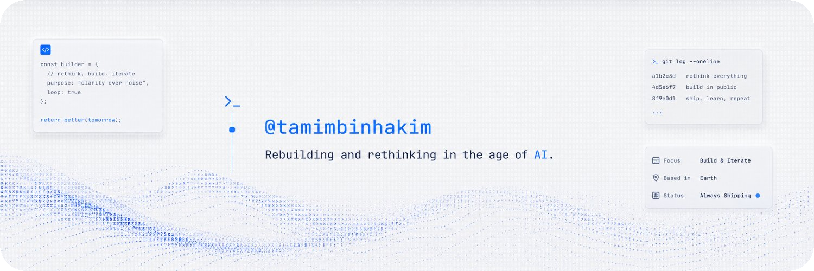

I build small, sharp software at [**Ruwad Group**](https://github.com/ruwadgroup), with a bias for clarity over noise.

### Currently shipping

- [**sukoon**](https://github.com/ruwadgroup/sukoon) - Privacy-first, on-device media filter that removes background music while keeping speech clear. Rust engine + browser extension.
- [**imprint-pdf**](https://github.com/ruwadgroup/imprint-pdf) - Author PDFs as React components, styled with real Tailwind CSS. No Chromium, ever.
- [**docxengine**](https://github.com/ruwadgroup/docxengine) - AI-optimized DOCX engine with a deterministic OOXML core and an MCP server.
- [**ctxpeek**](https://github.com/ruwadgroup/ctxpeek) - Turn any Git repo into fresh, version-pinned docs for AI coding assistants.
- [**marque**](https://github.com/tamimbinhakim/marque) - A cryptographically signed, federated messaging protocol proposed as a successor to SMTP and IMAP.
- [**autotranslate**](https://github.com/tamimbinhakim/autotranslate) - Automated, AI-powered i18n for any React framework. Code is the source of truth.
